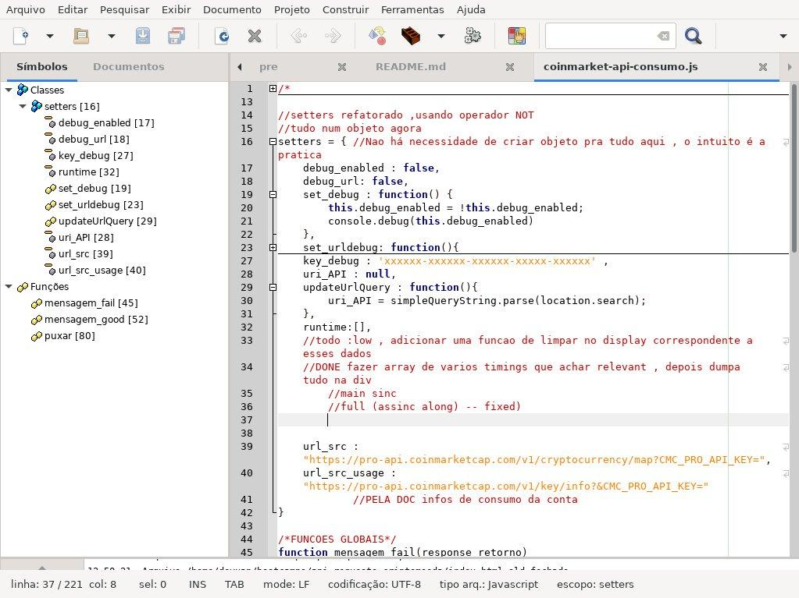

# VERSAO 2.9~stable changelog
- seguido propostas do curso
- custom features 
	+ mostrar o icone correspondente de cada criptomoeda
	+ failsafe caso nao tenha
	+ dropped jquery pra js nativo
	+ tempo de execucao main/full
	+ url query pra api key 
     - -  prefixo obrigatorio ?api=
    

> https://fshitstack.github.io/api-request-project/?api=xxx-xxx-xxx-xxx
>> caso nao existe ele pede ao usuario
    

# VERSAO 1

- remover credenciais antes do push
  	+ alternativa:  USAR `PROMPT()`

- escopos de função melhorados

-	mostra valores do /map com  um range especificado
-	mostra dados de uso da conta

------

Necessita de Moesif Origin & CORS Changer
devido restricoes de segurança do browser
> "Cross-Origin Request Blocked: The Same Origin Policy disallows reading the remote resource"

[Coinmarketcap - criar conta:  https://coinmarketcap.com](https://coinmarketcap.com)

[chrome](https://chrome.google.com/webstore/detail/moesif-orign-cors-changer/digfbfaphojjndkpccljibejjbppifbc)

[firefox](https://addons.mozilla.org/pt-BR/firefox/addon/moesif-origin-cors-changer1/)

## SCREENSHOTS

